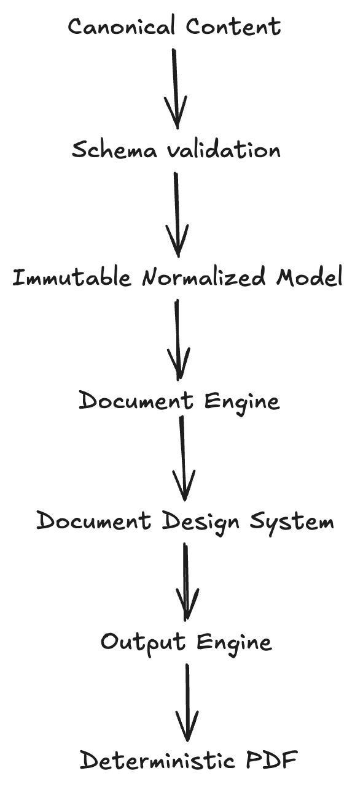
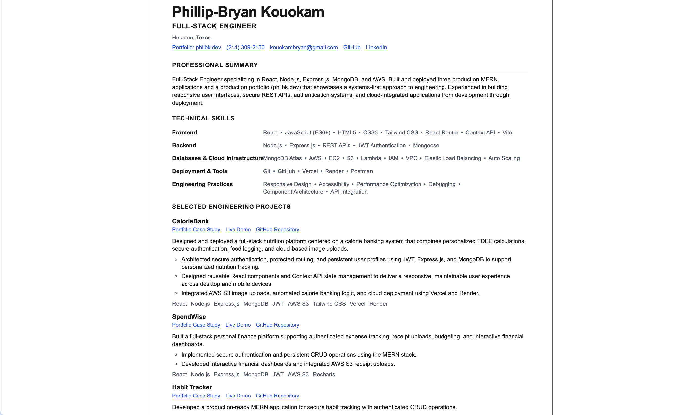
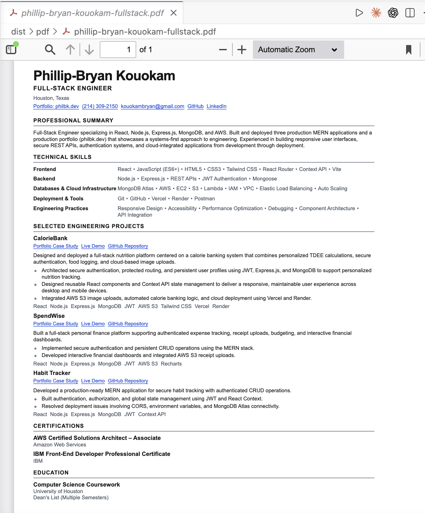

# philbk-resume

`philbk-resume` is a production-quality React document-generation system for creating a concise, ATS-friendly software engineering résumé. It is intentionally built as software—not maintained as a Word document—so content, presentation, validation, and output can evolve consistently over time.

The résumé is the printable counterpart of `philbk.dev`: systems-first, minimal, typographic, evidence-led, maintainable, scalable, and data-driven. It is a résumé generator, not a portfolio.

Resume v1.0 includes one published `fullstack` variant. The `frontend`, `startup`, and `cloud` variants remain drafts.

## Key Features

- Canonical, structured résumé content separated from presentation.
- Schema validation with readable failures for malformed content.
- Variant manifests that control selection and section order without renderer changes.
- One semantic, accessible HTML document for browser and PDF output.
- Editorial single-column design with dedicated screen and print styles.
- Deterministic US Letter PDF generation through pinned Chromium.
- Automated checks for page size, page count, overflow, selectable text, links, metadata, and repeated-byte determinism.
- ATS-oriented markup with conventional headings, lists, links, dates, and logical source order.

## Architecture Overview

The system treats résumé production as a publishing pipeline. Canonical facts and editorial choices enter through the content layer. The selected variant is validated and normalized into an immutable model, which the document engine renders as semantic HTML. The same document receives screen or print presentation before the Output Engine exports and validates the PDF.

Layer boundaries remain explicit:

- `content/` owns facts, wording, ordering, and variant strategy.
- `components/` owns semantic rendering and contains no résumé copy.
- `styles/` owns document presentation and media-specific behavior.
- `validation/` protects content, semantics, and print contracts.
- `scripts/output/` builds and validates production artifacts.

## Architecture Diagram



_The complete path from variant selection and schema validation to semantic rendering, deterministic PDF generation, and artifact validation._

```text
Variant registry
      ↓
Schema validation
      ↓
Immutable normalized model
      ↓
Semantic document engine
      ↓
Screen / print design system
      ↓
Pinned headless Chromium
      ↓
Canonical PDF metadata
      ↓
Output validation
      ↓
dist/pdf/<validated filename>
```

## Browser Preview



_The browser is the development environment: it renders the selected validated variant through the production document engine and shared design system._

Run `npm run dev`, then select a registered variant with the `variant` query parameter when needed:

```text
http://localhost:5173/?variant=fullstack
```

## Generated PDF



_The one-page US Letter artifact is generated from the same semantic document as the browser preview—there is no second template or PDF-specific component tree._

The exported PDF remains selectable, searchable, hyperlink-enabled, and ATS-friendly. Canonical metadata and deterministic filenames come from validated content. Repeated exports are byte-checked for determinism before an artifact is accepted.

## Project Structure

```text
philbk-resume/
├── scripts/
│   ├── export.js                 # export command entry point
│   ├── validate-content.js       # registry-wide content validation
│   └── output/                   # Chromium export and PDF validation
├── src/
│   ├── app/                      # variant selection and application boundary
│   ├── components/
│   │   ├── primitives/           # links and date rendering
│   │   └── resume/               # semantic document engine
│   ├── content/
│   │   ├── shared/               # canonical facts and résumé copy
│   │   ├── variants/             # published and draft manifests
│   │   ├── normalize.js          # immutable render-model normalization
│   │   ├── schema.js             # content contract
│   │   └── index.js              # variant registry and content API
│   ├── styles/                   # tokens, reset, screen, résumé, and print CSS
│   └── validation/               # content, document, ATS, and print tests
├── README.md
├── PRD.md
└── package.json
```

## Validation Pipeline

Every production export passes through the following gates:

1. Load the requested registered variant.
2. Validate required content, IDs, URLs, metadata, dates, and section order.
3. Normalize and deeply freeze the render model.
4. Build and serve the Vite production bundle locally.
5. Render the existing application with print media enabled.
6. Reject horizontal overflow, page overflow, browser warnings, and unexpected underfill.
7. Generate a tagged US Letter PDF with canonical metadata.
8. Verify page geometry, extracted text, link annotations, metadata, filename, and deterministic bytes.
9. Publish the validated artifact atomically to `dist/pdf/`.

Draft and invalid variants are rejected before browser export.

## Export Commands

```bash
# Export the default published variant
npm run export:pdf

# Export one named published variant
npm run export -- --variant fullstack

# Export every published variant
npm run export:all
```

The v1.0 artifact is written to:

```text
dist/pdf/phillip-bryan-kouokam-fullstack.pdf
```

## Variant System

Variants are ordered content manifests, not component forks. Each manifest uses the same schema, normalization stage, semantic renderer, styles, and Output Engine.

- `fullstack`: published and exportable.
- `frontend`: draft.
- `startup`: draft.
- `cloud`: draft.

Canonical facts live under `src/content/shared/`. A variant selects and orders those facts while owning target-specific editorial choices. Publishing another variant does not require redesigning the application.

## Development

### Requirements

- Node.js 22.12 or newer.
- npm.
- Playwright's pinned Chromium build for PDF export.

### Setup

```bash
npm install
npx playwright install chromium
npm run dev
```

### Quality Commands

```bash
npm run lint
npm run test
npm run validate:content
npm run build
npm run preview
```

See [PRD.md](./PRD.md) for the product requirements and architectural decisions.

## License

This repository does not currently include a software license.
